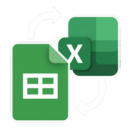
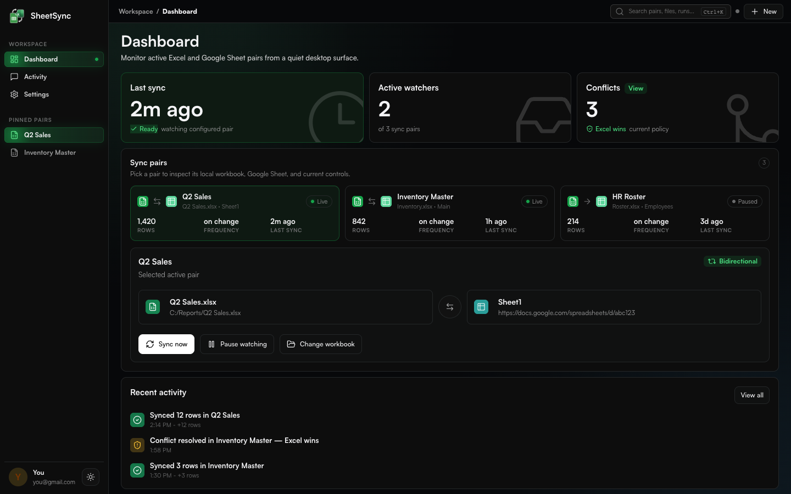

<a id="readme-top"></a>

<h1 align="center">
  
  <br />
  <b>SheetSync</b>
</h1>

<p align="center">
  A Windows desktop app that keeps local Excel workbooks in sync with Google Sheets - automatically or on demand.
</p>

<p align="center">
  <a href="https://github.com/Hezi777/SheetSync/releases/latest">
    
  </a>
  
  
  
  
</p>

<details>
  <summary>Table of Contents</summary>
  <ol>
    <li><a href="#about">About</a></li>
    <li><a href="#install">Install</a></li>
    <li><a href="#features">Features</a></li>
    <li><a href="#screenshots">Screenshots</a></li>
    <li><a href="#tech-stack">Tech Stack</a></li>
    <li><a href="#oauth-setup">OAuth Setup</a></li>
    <li><a href="#getting-started-from-source">Getting Started From Source</a></li>
    <li><a href="#development">Development</a></li>
    <li><a href="#release-build">Release Build</a></li>
    <li><a href="#project-structure">Project Structure</a></li>
    <li><a href="#local-data">Local Data</a></li>
    <li><a href="#troubleshooting">Troubleshooting</a></li>
    <li><a href="#privacy">Privacy</a></li>
    <li><a href="#contributing">Contributing</a></li>
    <li><a href="#license">License</a></li>
  </ol>
</details>

---

## About

SheetSync is built for people who still work in Excel locally but need a reliable Google Sheets mirror. It watches configured `.xlsx` files for changes, merges both sides, and writes the result back - with no server required and no shared credentials.

Each user supplies their own Google Cloud Desktop OAuth JSON. Credentials and tokens stay on the local PC. Google access can be revoked at any time from [Google Account settings](https://myaccount.google.com/permissions).

<p align="right">(<a href="#readme-top">back to top</a>)</p>

---

## Install

Download the latest Windows installer from the [Releases page](https://github.com/Hezi777/SheetSync/releases/latest):

| Release | Installer |
|---|---|
| `v1.0.1` | [`SheetSyncSetup-1.0.1.exe`](https://github.com/Hezi777/SheetSync/releases/download/v1.0.1/SheetSyncSetup-1.0.1.exe) |

The installer is generated with Inno Setup and installs SheetSync under the current user's local app directory. No admin rights required.

<p align="right">(<a href="#readme-top">back to top</a>)</p>

---

## Features

| Area | What SheetSync does |
|---|---|
| File watching | Detects local `.xlsx` saves and triggers a sync automatically |
| Bidirectional sync | Merges Excel and Sheets and writes the result to both sides |
| Sync direction | Per-pair control: Bidirectional, Excel to Sheets, or Sheets to Excel |
| Conflict handling | Configurable policy (Excel wins or Sheets wins) with a per-session conflict log |
| Column mappings | Map Excel column names to their Sheets equivalents before syncing |
| Interval sync | Optional timer-based sync (5, 15, 30, or 60 minutes) |
| Sheets polling | Detect remote changes by hashing the sheet at a configurable interval |
| Multiple pairs | Add, pin, pause, and remove independent sync pairs from one workspace |
| Offline queue | Queues sync attempts when offline and retries on reconnect |
| System tray | Minimize to tray to keep watchers running while the window is hidden |
| Desktop notifications | Optional OS-level sync result alerts |
| Activity log | Full event history exportable as CSV |

<p align="right">(<a href="#readme-top">back to top</a>)</p>

---

## Screenshots

| Dashboard |
|---|
|  |

<p align="right">(<a href="#readme-top">back to top</a>)</p>

---

## Tech Stack

| Layer | Technology |
|---|---|
| Desktop shell | PyWebView 5.4 |
| Backend | Python 3.11+ |
| File watching | watchdog 6.0 |
| Excel IO | openpyxl 3.1 |
| Google Sheets | gspread 6.2, google-auth, google-auth-oauthlib |
| UI | React, Vite, lucide-react, Satoshi font |
| Tray / notifications | pystray, plyer, Pillow |
| Packaging | PyInstaller 6.20, Inno Setup |

<p align="right">(<a href="#readme-top">back to top</a>)</p>

---

## OAuth Setup

SheetSync reads and writes private spreadsheets as the signed-in Google account. An API key is not sufficient - OAuth is required.

1. Open [Google Cloud Console](https://console.cloud.google.com) and create or select a project.
2. Enable **Google Sheets API**.
3. Enable **Google Drive API**.
4. Go to **APIs & Services > Credentials > Create OAuth Client ID**.
5. Choose application type **Desktop app** and download the JSON file.
6. Launch SheetSync, choose the JSON on the first onboarding step, then sign in with Google.

<p align="right">(<a href="#readme-top">back to top</a>)</p>

---

## Getting Started From Source

**Prerequisites:** Windows 10+, Python 3.11+, Node.js 18+

```powershell
python -m venv .venv
.\.venv\Scripts\pip install -r requirements.txt
npm install
npm run build
.\.venv\Scripts\python src\sheetsync_desktop.py
```

<p align="right">(<a href="#readme-top">back to top</a>)</p>

---

## Development

| Command | Description |
|---|---|
| `npm run dev` | Start the Vite dev server (browser preview only) |
| `npm run build` | Build `src/sheetsync/ui/dist` for PyWebView |
| `python -m compileall src scripts` | Validate Python syntax |
| `python scripts/build.py` | Build `dist/SheetSync.exe` via PyInstaller |
| `python scripts/build_installer.py` | Build the Inno Setup installer |

The desktop app loads `src/sheetsync/ui/dist/index.html`. Rebuild the UI before packaging or testing the production shell.

<p align="right">(<a href="#readme-top">back to top</a>)</p>

---

## Release Build

SheetSync uses Semantic Versioning. See [VERSION.md](VERSION.md).

```powershell
npm run build
python -m compileall src scripts
python scripts\build.py
python scripts\build_installer.py
```

| Output | Purpose |
|---|---|
| `dist\SheetSync.exe` | Portable desktop executable |
| `packaging\installer\Output\SheetSyncSetup-<version>.exe` | Inno Setup installer |

Release checklist:
1. Update `packaging/installer/SheetSync.iss`.
2. Update `VERSION.md`.
3. Build the UI, EXE, and installer.
4. Tag the commit as `v<version>`.
5. Upload the setup EXE to GitHub Releases.

<p align="right">(<a href="#readme-top">back to top</a>)</p>

---

## Project Structure

```
src/
  sheetsync/
    api.py              PyWebView JS-to-Python bridge
    core/               auth, storage, sync engine, tray, watcher
    ui/                 React/Vite UI source
      dist/             built bundle loaded by PyWebView
  sheetsync_desktop.py  entry point
assets/
  icons/                app logo and Windows ICO
scripts/
  build.py              PyInstaller helper
  build_installer.py    Inno Setup helper
```

<p align="right">(<a href="#readme-top">back to top</a>)</p>

---

## Local Data

All runtime state is stored in `%APPDATA%\SheetSync`:

| File | Purpose |
|---|---|
| `config.json` | App settings and sync pair configuration |
| `credentials.json` | User-supplied Google OAuth Desktop client |
| `token.json` | Local Google OAuth token |
| `activity.json` | Sync activity history |
| `sync_queue.json` | Queued offline sync attempts |

These files are machine-local and should never be committed to source control.

<p align="right">(<a href="#readme-top">back to top</a>)</p>

---

## Troubleshooting

| Message | Fix |
|---|---|
| `Choose your own Google OAuth Desktop client JSON before signing in` | Restart onboarding and choose the OAuth Desktop client JSON. |
| `Google account is not connected` | Connect Google from onboarding or Settings. |
| `Excel file not found` | Update the path in Settings to the moved or renamed workbook. |
| `Waiting for Excel to release file` | Excel is still writing the file; SheetSync retries automatically. |
| `Match column 'ID' is missing` | Add the configured column to both header rows, or switch to row-position matching. |
| `Offline` | SheetSync queues the attempt and retries on the next file-triggered or manual sync. |

<p align="right">(<a href="#readme-top">back to top</a>)</p>

---

## Privacy

OAuth credentials and tokens are stored locally on the user's PC. Spreadsheet data is sent only to Google's APIs for the configured sheet. Access can be revoked at any time from [Google Account security settings](https://myaccount.google.com/permissions).

<p align="right">(<a href="#readme-top">back to top</a>)</p>

---

## Contributing

1. Fork the repository.
2. Create a feature branch: `git checkout -b feature/your-feature`
3. Commit your changes: `git commit -m "Add your feature"`
4. Push to the branch: `git push origin feature/your-feature`
5. Open a Pull Request.

<p align="right">(<a href="#readme-top">back to top</a>)</p>
